# GYATK.COM — Complete Website Analysis

> **Analyzed**: September 5, 2026  
> **Domain**: https://gyatk.com/  
> **Platform**: WordPress (Yoast SEO + Google Sitemap Generator)  
> **Company**: GYATK RVCR Apparatus Pvt Ltd (India) / KGYAT Wind Power Ltd (UK)

---

## 1. Website Overview

**GYATK** is the official website for the inventors of globally patented **RVCR (Rotary Variable Compression Ratio)** technology — a new paradigm in climate tech. The site promotes their energy-conversion mechanism technology, which targets zero-carbon systems for the transport and energy sectors.

### Key Business Info
| Field | Detail |
|-------|--------|
| **Phone** | +91 74030 08844 |
| **Email** | info@gyatk.com |
| **India Entity** | GYATK RVCR Apparatus Pvt Ltd |
| **UK Entity** | KGYAT Wind Power Ltd |
| **Product Project Site** | https://kgyat.com/ |
| **RVCR Tech Site** | https://rvcr.tech/ |
| **Site Designer** | [Pro Next Digital](https://pronextdigital.com/) |

---

## 2. Complete Site Architecture & Page Inventory

### 2.1 Main Navigation Pages (19 unique pages)

| # | Page | URL | Last Modified |
|---|------|-----|---------------|
| 1 | **Home** | https://gyatk.com/ | 2025-10-28 |
| 2 | **About Us / Zero Emission Technology** | https://gyatk.com/zero-emission-technology/ | 2023-12-05 |
| 3 | **Patents** | https://gyatk.com/patents/ | 2023-07-27 |
| 4 | **Blog** | https://gyatk.com/blog/ | 2023-07-27 |
| 5 | **Contact Us** | https://gyatk.com/contact-us/ | 2023-06-17 |
| 6 | **Our Proposition** | https://gyatk.com/proposition/ | 2023-08-10 |
| 7 | **Strategic Advantage** | https://gyatk.com/strategic-advantage/ | 2023-08-10 |
| 8 | **What We Offer** | https://gyatk.com/what-we-offer/ | 2023-08-10 |
| 9 | **Why RVCR** | https://gyatk.com/why-rvcr/ | 2023-08-10 |
| 10 | **RVCR Market** | https://gyatk.com/rvcr-market/ | 2023-08-10 |
| 11 | **RVCR Business Case** | https://gyatk.com/rvcr-business-case/ | 2023-09-11 |
| 12 | **Technical Services** | https://gyatk.com/technical-services/ | 2023-08-10 |
| 13 | **Technology & Innovation Services** | https://gyatk.com/technology-and-innovation-services/ | 2023-08-10 |
| 14 | **Commercial Services** | https://gyatk.com/commercial-services/ | 2023-08-10 |
| 15 | **Gallery (Main)** | https://gyatk.com/gallery/ | 2023-06-27 |
| 16 | **Landing Page** | https://gyatk.com/landing-page/ | 2024-01-25 |

### 2.2 Gallery / Location Sub-Pages (6 pages)

| # | Page | URL | Last Modified |
|---|------|-----|---------------|
| 1 | **Abu Dhabi Gallery** | https://gyatk.com/abu-dhabi/ | 2023-06-16 |
| 2 | **Detroit Gallery** | https://gyatk.com/detroit/ | 2023-06-17 |
| 3 | **San Francisco Gallery** | https://gyatk.com/francisco/ | 2023-06-17 |
| 4 | **Tehran Gallery** | https://gyatk.com/gallery/tehran/ | 2023-06-17 |
| 5 | **Trivandrum Gallery** | https://gyatk.com/gallery/trivandrum/ | 2023-06-17 |
| 6 | **Stuttgart Gallery** | https://gyatk.com/stuttgart/ | 2023-06-17 |

### 2.3 Blog Posts (10 posts)

| # | Post Title (Slug) | URL | Last Modified |
|---|-------------------|-----|---------------|
| 1 | Beyond Carbon: Hydrogen's Green Energy Evolution | https://gyatk.com/beyond-carbon-hydrogens-green-energy-evolution/ | 2023-11-02 |
| 2 | Global Warming: Cracking the Code | https://gyatk.com/global-warming-cracking-the-code/ | 2023-11-02 |
| 3 | Power: Heart of the Modern World Engine | https://gyatk.com/power-heart-of-the-modern-world-engine-let-us-talk-about-its-past-present-and-to-be-future/ | 2023-11-02 |
| 4 | RVCR – A New Dimension in Zero Carbon Technologies | https://gyatk.com/rvcr-a-new-dimension-in-zero-carbon-technologies/ | 2023-11-02 |
| 5 | Climate Change | https://gyatk.com/climate-change/ | 2023-12-05 |
| 6 | Zero Emissions | https://gyatk.com/zero-emissions/ | 2023-12-05 |
| 7 | Commercial Carbon Footprint Reduction | https://gyatk.com/commercial-carbon-footprint-reduction/ | 2024-01-06 |
| 8 | Challenges of Green Technology | https://gyatk.com/challenges-of-green-technology/ | 2024-02-14 |
| 9 | Zero Emission Systems | https://gyatk.com/zero-emission-systems/ | 2024-03-08 |
| 10 | Striving for India's Innovation & Sustainability with RVCR | https://gyatk.com/striving-for-indias-innovation-and-sustainability-with-rvcr-technology/ | 2026-03-04 |

### 2.4 Legacy Services Pages (12 pages)

These appear to be from a previous iteration of the site (AI/data-focused), now repurposed for RVCR technology:

| # | Page | URL | Last Modified |
|---|------|-----|---------------|
| 1 | Services Hub | https://gyatk.com/services/ | 2023-04-05 |
| 2 | Data Engineers | https://gyatk.com/services/data-engineers/ | 2020-11-04 |
| 3 | Data Strategies | https://gyatk.com/services/data-strategies/ | 2020-11-04 |
| 4 | Faster Customer Resolutions | https://gyatk.com/services/faster-customer-resolutions/ | 2020-11-04 |
| 5 | AI Software Development | https://gyatk.com/services/ai-software-development/ | 2020-11-19 |
| 6 | Code Free Customization | https://gyatk.com/services/code-free-customization/ | 2020-11-19 |
| 7 | Data Science & AI Consulting | https://gyatk.com/services/data-science-ai-consulting/ | 2020-11-19 |
| 8 | Data Scientists | https://gyatk.com/services/data-scientists/ | 2020-11-19 |
| 9 | Facing an AI Challenge | https://gyatk.com/services/facing-an-ai-challenge/ | 2020-11-19 |
| 10 | More Leads 24/7 | https://gyatk.com/services/more-leads-24-7/ | 2020-11-19 |
| 11 | Automate Tagging | https://gyatk.com/services/automate-tagging/ | 2020-11-19 |
| 12 | Our Proposition (Legacy) | https://gyatk.com/services/our-proposition/ | 2023-02-08 |
| 13 | The Gains | https://gyatk.com/services/the-gains/ | 2023-04-05 |
| 14 | Support Services | https://gyatk.com/services/support-services/ | 2023-04-05 |

### 2.5 Case Studies (2 pages)

| # | Page | URL | Last Modified |
|---|------|-----|---------------|
| 1 | Case Study Hub | https://gyatk.com/case_study/ | 2020-11-25 |
| 2 | Zero In On Customer Behavior | https://gyatk.com/case_study/zero-in-on-customer-behavior/ | 2020-11-25 |

### 2.6 Template Pages (Headers/Footers — 18 pages)

| # | Page | URL | Last Modified |
|---|------|-----|---------------|
| 1 | Header 1 | https://gyatk.com/hf_template/header-1/ | 2020-11-26 |
| 2 | Header 2 | https://gyatk.com/hf_template/header-2/ | 2020-12-10 |
| 3 | Header 3 | https://gyatk.com/hf_template/header-3/ | 2025-01-17 |
| 4 | Header 4 | https://gyatk.com/hf_template/header-4/ | 2020-03-09 |
| 5 | Header 5 | https://gyatk.com/hf_template/header-5/ | 2020-09-16 |
| 6 | Header 6 | https://gyatk.com/hf_template/header-6/ | 2021-08-03 |
| 7 | Header 7 | https://gyatk.com/hf_template/header-7/ | 2021-12-20 |
| 8 | Header 8 | https://gyatk.com/hf_template/header-8/ | 2021-12-08 |
| 9 | Header 9 | https://gyatk.com/hf_template/header-9/ | 2021-12-20 |
| 10 | Header Mobile 1 | https://gyatk.com/hf_template/header-mobile-1/ | 2020-08-13 |
| 11 | Footer 1 | https://gyatk.com/hf_template/footer-1/ | 2021-01-04 |
| 12 | Footer 2 | https://gyatk.com/hf_template/footer-2/ | 2021-06-11 |
| 13 | Footer 3 | https://gyatk.com/hf_template/footer-3/ | 2023-06-09 |
| 14 | Footer 4 | https://gyatk.com/hf_template/footer-4/ | 2021-01-04 |
| 15 | Footer 5 | https://gyatk.com/hf_template/footer-5/ | 2021-01-04 |
| 16 | Footer 6 | https://gyatk.com/hf_template/footer-6/ | 2020-03-09 |
| 17 | Footer 7 | https://gyatk.com/hf_template/footer-7/ | 2021-12-17 |
| 18 | Footer 8 | https://gyatk.com/hf_template/footer-8/ | 2021-12-16 |
| 19 | Footer 9 | https://gyatk.com/hf_template/footer-9/ | 2021-12-17 |

### 2.7 Category & Author Pages

| # | Page | URL | Last Modified |
|---|------|-----|---------------|
| 1 | Category: GYATK | https://gyatk.com/category/gyatk/ | 2026-03-04 |

### 2.8 WordPress System Pages

| # | Page | URL |
|---|------|-----|
| 1 | WP Login / Lost Password | https://gyatk.com/wp-login.php?action=lostpassword |

---

## 3. Complete Link Inventory

### 3.1 Internal Navigation Links (Homepage)

| Link Text | Target | Section |
|-----------|--------|---------|
| Home | https://gyatk.com/ | Main Nav |
| About Us | https://gyatk.com/zero-emission-technology/ | Main Nav |
| Blog | https://gyatk.com/blog/ | Main Nav |
| Contact Us | https://gyatk.com/contact-us/ | Main Nav |
| Who We Are | https://gyatk.com/#whowe | Anchor |
| Our Pursuit | https://gyatk.com/#pursuit | Anchor |
| Our IPR Reach | https://gyatk.com/#reach | Anchor |
| What We Offer | https://gyatk.com/#whatweoffer / #offer | Anchor |
| RVCR Opportunities | https://gyatk.com/#opportunities | Anchor |
| Projects | https://gyatk.com/#projects | Anchor |
| Gallery | https://gyatk.com/#gallery | Anchor |
| Join Us | https://gyatk.com/#contactus / #joinus | Anchor |
| Credits & Awards | https://gyatk.com/#awards | Anchor |
| Contact Us (anchor) | https://gyatk.com/#contactus | Anchor |

### 3.2 Internal CTA Links (Homepage Body)

| Link Text | Target URL |
|-----------|------------|
| About us | https://gyatk.com/zero-emission-technology/ |
| See all patents | https://gyatk.com/patents/ |
| Learn More (Strategic Advantage) | https://gyatk.com/strategic-advantage |
| Learn More (Proposition) | https://gyatk.com/proposition |
| Learn More (What We Offer) | https://gyatk.com/what-we-offer |
| Learn more (Why RVCR) | https://gyatk.com/why-rvcr |
| Learn more (RVCR Market) | https://gyatk.com/rvcr-market/ |
| Learn more (Business Case) | https://gyatk.com/rvcr-business-case/ |
| View more (Gallery) | https://gyatk.com/gallery/ |
| Know More (Landing Page) | https://gyatk.com/landing-page/ |

### 3.3 Footer Quick Links

| Link Text | Target URL |
|-----------|------------|
| Our Proposition | https://gyatk.com/proposition |
| RVCR Business Case | https://gyatk.com/rvcr-business-case/ |
| Strategic Advantage | https://gyatk.com/strategic-advantage |
| Technical Services | https://gyatk.com/technical-services |
| Technology And Innovation Services | https://gyatk.com/technology-and-innovation-services |
| Commercial Services | https://gyatk.com/commercial-services |
| What We Offer | https://gyatk.com/what-we-offer/ |
| Why RVCR | https://gyatk.com/why-rvcr/ |

### 3.4 External Links

| Link Text | Target URL | Type |
|-----------|------------|------|
| Facebook | https://www.facebook.com/gyatk.technologies | Social Media |
| Twitter | https://twitter.com/gyatktech | Social Media |
| YouTube | https://www.youtube.com/@gyatk4479 | Social Media |
| Instagram | https://www.instagram.com/gyatk.technologies/ | Social Media |
| LinkedIn | https://uk.linkedin.com/company/gyatk | Social Media |
| About RVCR | https://rvcr.tech/ | Sister Site |
| RVCR Product Project | https://kgyat.com/ | Sister Site |
| Pro Next Digital | https://pronextdigital.com/ | Web Designer |
| Phone | tel:+917403008844 | Contact |
| Email | mailto:info@gyatk.com | Contact |

---

## 4. Complete Image & Media Asset Inventory

### 4.1 Homepage Assets

| # | Asset URL | Type |
|---|-----------|------|
| 1 | /wp-content/uploads/2020/03/gyatk-logo-svg.png | Logo (PNG) |
| 2 | /wp-content/uploads/2023/06/circle-energy-ball.png | Graphic (PNG) |
| 3 | /wp-content/uploads/2020/03/circle-drive-ball.png | Graphic (PNG) |
| 4 | /wp-content/uploads/2023/06/circle-power-ball.png | Graphic (PNG) |
| 5 | /wp-content/uploads/2023/06/New-Project-7.jpg | Photo (JPG) |
| 6 | /wp-content/uploads/2023/05/rvcr-commercializing.jpg | Photo (JPG) |
| 7 | /wp-content/uploads/2020/04/globe-copy.svg | Icon (SVG) |
| 8 | /wp-content/uploads/2020/04/wind-mill-copy.svg | Icon (SVG) |
| 9 | /wp-content/uploads/2023/04/customer-service.png | Icon (PNG) |
| 10 | /wp-content/uploads/2023/06/New-Project-9.jpg | Photo (JPG) |
| 11 | /wp-content/uploads/2023/03/energy-and-transport.jpg | Photo (JPG) |
| 12 | /wp-content/uploads/2023/06/New-Project-8.jpg | Photo (JPG) |
| 13 | /wp-content/uploads/2023/02/Phy-Detroit-Proto-pic-left-Iso.jpg | Photo (JPG) |

### 4.2 Gallery Images (WebP Format)

| # | Asset Path | Gallery |
|---|-----------|---------|
| 1 | /wp-content/uploads/2020/03/15.webp | Home Gallery |
| 2 | /wp-content/uploads/2020/03/13.webp | Home Gallery |
| 3 | /wp-content/uploads/2020/03/9.webp | Home Gallery |
| 4 | /wp-content/uploads/2020/03/2.webp | Home Gallery |
| 5 | /wp-content/uploads/2020/03/tr-12.webp | Home Gallery |
| 6 | /wp-content/uploads/2020/03/tr-10.webp | Home Gallery |
| 7 | /wp-content/uploads/2020/03/tr-9.webp | Home Gallery |
| 8 | /wp-content/uploads/2020/03/tr-5.webp | Home Gallery |
| 9 | /wp-content/uploads/2020/03/tr-4.webp | Home Gallery |
| 10 | /wp-content/uploads/2020/03/t-6.webp | Home Gallery |
| 11 | /wp-content/uploads/2020/03/d-7.webp | Home Gallery |
| 12 | /wp-content/uploads/2020/03/a1-6.webp | Home Gallery |

### 4.3 Abu Dhabi Gallery Images

| # | Asset Path |
|---|-----------|
| 1 | /wp-content/uploads/2020/03/a1-3.webp |
| 2 | /wp-content/uploads/2020/03/a1-4.webp |
| 3 | /wp-content/uploads/2020/03/a1-5.webp |
| 4 | /wp-content/uploads/2020/03/a1-6.webp |
| 5 | /wp-content/uploads/2020/03/a1-8.webp |
| 6 | /wp-content/uploads/2020/03/a1-9.webp |
| 7 | /wp-content/uploads/2020/03/a1-10.webp |
| 8 | /wp-content/uploads/2020/03/a1-11.webp |
| 9 | /wp-content/uploads/2020/03/a1-12.webp |
| 10 | /wp-content/uploads/2020/03/a1-13.webp |
| 11 | /wp-content/uploads/2020/03/a1-14.webp |
| 12 | /wp-content/uploads/2020/03/a1-15.webp |
| 13 | /wp-content/uploads/2020/03/a1-16.webp |

### 4.4 Detroit Gallery Images

| # | Asset Path |
|---|-----------|
| 1 | /wp-content/uploads/2020/03/d-1.webp |
| 2 | /wp-content/uploads/2020/03/d-2.webp |
| 3 | /wp-content/uploads/2020/03/d-3.webp |
| 4 | /wp-content/uploads/2020/03/d-4.webp |
| 5 | /wp-content/uploads/2020/03/d-5-1.webp |
| 6 | /wp-content/uploads/2020/03/d-6-1.webp |
| 7 | /wp-content/uploads/2020/03/d-7-1.webp |
| 8 | /wp-content/uploads/2020/03/d-8-1.webp |

### 4.5 San Francisco Gallery Images

| # | Asset Path |
|---|-----------|
| 1 | /wp-content/uploads/2020/03/s-1.webp |
| 2 | /wp-content/uploads/2020/03/s-2.webp |
| 3 | /wp-content/uploads/2020/03/s-3.webp |
| 4 | /wp-content/uploads/2020/03/s-4.webp |
| 5 | /wp-content/uploads/2020/03/s-5.webp |
| 6 | /wp-content/uploads/2020/03/s-6.webp |
| 7 | /wp-content/uploads/2020/03/s-7.webp |
| 8 | /wp-content/uploads/2020/03/s-8.webp |
| 9 | /wp-content/uploads/2020/03/s-9.webp |
| 10 | /wp-content/uploads/2020/03/s-10.webp |
| 11 | /wp-content/uploads/2020/03/s-11.webp |
| 12 | /wp-content/uploads/2020/03/s-12.webp |

### 4.6 Tehran Gallery Images

| # | Asset Path |
|---|-----------|
| 1 | /wp-content/uploads/2020/03/t-1.webp |
| 2 | /wp-content/uploads/2020/03/t-2.webp |
| 3 | /wp-content/uploads/2020/03/t-3.webp |
| 4 | /wp-content/uploads/2020/03/t-4.webp |
| 5 | /wp-content/uploads/2020/03/t-5.webp |
| 6 | /wp-content/uploads/2020/03/t-6.webp |
| 7 | /wp-content/uploads/2020/03/t-7.webp |

### 4.7 Trivandrum Gallery Images

| # | Asset Path |
|---|-----------|
| 1 | /wp-content/uploads/2020/03/tr-2.webp |
| 2 | /wp-content/uploads/2020/03/tr-3.webp |
| 3 | /wp-content/uploads/2020/03/tr-4.webp |
| 4 | /wp-content/uploads/2020/03/tr-5.webp |
| 5 | /wp-content/uploads/2020/03/tr-6.webp |
| 6 | /wp-content/uploads/2020/03/tr-7.webp |
| 7 | /wp-content/uploads/2020/03/tr-8.webp |
| 8 | /wp-content/uploads/2020/03/tr-9.webp |
| 9 | /wp-content/uploads/2020/03/tr-10.webp |
| 10 | /wp-content/uploads/2020/03/tr-11.webp |
| 11 | /wp-content/uploads/2020/03/tr-12.webp |

### 4.8 Stuttgart Gallery Images

| # | Asset Path |
|---|-----------|
| 1 | /wp-content/uploads/2020/03/17-768x512-1.webp |
| 2 | /wp-content/uploads/2020/03/16-1-768x512-1.webp |
| 3 | /wp-content/uploads/2020/03/15-1-768x512-1.webp |
| 4 | /wp-content/uploads/2020/03/8-300x226-1.webp |
| 5 | /wp-content/uploads/2020/03/7-300x225-1.webp |
| 6 | /wp-content/uploads/2020/03/6-300x226-1.webp |
| 7 | /wp-content/uploads/2020/03/5-1-300x226-1.webp |
| 8 | /wp-content/uploads/2020/03/4-1-300x226-1.webp |
| 9 | /wp-content/uploads/2020/03/2-2-300x226-1.webp |
| 10 | /wp-content/uploads/2020/03/14-300x200-1.webp |
| 11 | /wp-content/uploads/2020/03/17-300x200-1.webp |
| 12 | /wp-content/uploads/2020/03/13-1-300x200-1.webp |
| 13 | /wp-content/uploads/2020/03/3-300x225-1.webp |
| 14 | /wp-content/uploads/2020/03/1-300x226-1.webp |
| 15 | /wp-content/uploads/2020/03/10-300x200-1.webp |
| 16 | /wp-content/uploads/2020/03/12-300x200-1.webp |
| 17 | /wp-content/uploads/2020/03/11-300x200-1.webp |
| 18 | /wp-content/uploads/2020/03/9-2-300x200-1.webp |
| 19 | /wp-content/uploads/2023/06/2-1.webp |

### 4.9 Page-Specific Content Images

| # | Asset Path | Used On |
|---|-----------|---------|
| 1 | /wp-content/uploads/2023/06/Power-gyatk.png | About / Zero Emission |
| 2 | /wp-content/uploads/2023/06/New-Project-5.png | About / Zero Emission |
| 3 | /wp-content/uploads/2023/06/New-Project-6.png | About / Zero Emission |
| 4 | /wp-content/uploads/2023/05/gyatk-team-1.jpg | About / Zero Emission |
| 5 | /wp-content/uploads/2023/03/vission.png | About / Zero Emission |
| 6 | /wp-content/uploads/2023/03/mission.png | About / Zero Emission |
| 7 | /wp-content/uploads/2023/03/strength.png | About / Zero Emission |
| 8 | /wp-content/uploads/2023/03/climate-change.jpg | About / Zero Emission |
| 9 | /wp-content/uploads/2023/03/earth.png | About / Zero Emission |
| 10 | /wp-content/uploads/2023/03/motivation.png | About / Zero Emission |
| 11 | /wp-content/uploads/2020/03/philosophy.png | About / Zero Emission |
| 12 | /wp-content/uploads/2023/04/shaft.png | Patents |
| 13 | /wp-content/uploads/2023/06/patents-dashboard2-1-1.jpg | Patents |
| 14 | /wp-content/uploads/2021/12/Key-features.jpg | Patents |
| 15 | /wp-content/uploads/2023/05/we-offer-rights.png | Patents |
| 16 | /wp-content/uploads/2023/06/new-image.jpg | Proposition |
| 17 | /wp-content/uploads/2023/05/home-flowchart-1024x233-1.png | Proposition |
| 18 | /wp-content/uploads/2023/05/global-1.jpg | Proposition |
| 19 | /wp-content/uploads/2023/06/rvcr-market.png | RVCR Market |
| 20 | /wp-content/uploads/2023/04/gif-1.gif | RVCR Market |
| 21 | /wp-content/uploads/2023/05/Technology-1260x840-1.jpg | RVCR Market |
| 22 | /wp-content/uploads/2023/05/rvcr-market-img.jpg | RVCR Market |
| 23 | /wp-content/uploads/2023/05/26252312_7168169.jpg | RVCR Market |
| 24 | /wp-content/uploads/2023/05/3d-rendering-hydraulic-elements.jpg | RVCR Market |
| 25 | /wp-content/uploads/2023/05/mce-5.jpg | RVCR Market |
| 26 | /wp-content/uploads/2023/06/GYATKrvcr-1.jpg | What We Offer / Services |
| 27 | /wp-content/uploads/2023/06/New-Project-16.jpg | What We Offer |
| 28 | /wp-content/uploads/2023/04/dd-design.jpg | What We Offer |
| 29 | /wp-content/uploads/2023/05/technology-assessment.jpg | What We Offer |
| 30 | /wp-content/uploads/2023/04/Zero-Carbon-Logo-Green-1200x1104-1.png | Multiple Service Pages |
| 31 | /wp-content/uploads/2023/04/technical-operation-management.jpg | Tech & Innovation / Business Case |
| 32 | /wp-content/uploads/2023/04/close-up-businessman-sitting-signing-contract.jpg | Tech & Innovation |
| 33 | /wp-content/uploads/2023/04/ai-nuclear-energy-background-future-innovation-disruptive-technology.jpg | Tech & Innovation |
| 34 | /wp-content/uploads/2023/05/project-ip.jpg | Tech & Innovation |
| 35 | /wp-content/uploads/2023/04/eng-work.jpg | Technical Services |
| 36 | /wp-content/uploads/2023/04/businessmen-businesswomen-meeting-brainstorming-ideas.jpg | Technical Services |
| 37 | /wp-content/uploads/2023/05/FIL921-s.jpg | Technical Services |
| 38 | /wp-content/uploads/2023/05/advertised.jpg | Technical Services |
| 39 | /wp-content/uploads/2023/05/analysis-simulation.jpg | Technical Services |
| 40 | /wp-content/uploads/2023/04/thoughtful-man-with-infographic-with-heads.jpg | Technical / Commercial |
| 41 | /wp-content/uploads/2023/04/carbon-transition.jpg | Strategic Advantage |
| 42 | /wp-content/uploads/2023/04/influence.jpg | Strategic Advantage |
| 43 | /wp-content/uploads/2023/06/Pre-emitive-product.jpg | Strategic Advantage |
| 44 | /wp-content/uploads/2023/04/technology-db.jpg | Why RVCR |
| 45 | /wp-content/uploads/2023/04/problem.jpg | Why RVCR |
| 46 | /wp-content/uploads/2023/04/solution.png | Why RVCR |
| 47 | /wp-content/uploads/2023/05/engine-with-bg.png | RVCR Business Case |
| 48 | /wp-content/uploads/2023/05/12.jpg.jpg | RVCR Business Case |
| 49 | /wp-content/uploads/2023/04/project-assessment.jpg | Commercial Services |
| 50 | /wp-content/uploads/2023/04/production-cost.jpg | Commercial Services |
| 51 | /wp-content/uploads/2023/05/GYATK.jpg | Commercial Services |
| 52 | /wp-content/uploads/2023/05/GYATK-2.jpg | Commercial Services |
| 53 | /wp-content/uploads/2023/04/closeup-blueprint-architecture-layout-plan.jpg | Commercial Services |

### 4.10 Blog Post Images

| # | Asset Path | Blog Post |
|---|-----------|-----------|
| 1 | /wp-content/uploads/2023/08/view-power-plant-emitting-co2-near-forest-1.jpg | Hydrogen's Green Energy |
| 2 | /wp-content/uploads/2023/09/view-bioengineering-advance-with-human-hands-1.jpg | Hydrogen's Green Energy |
| 3 | /wp-content/uploads/2023/06/global-warming-1.jpg | Global Warming |
| 4 | /wp-content/uploads/2020/02/Article-1-768x768-1.png | Power: Modern World Engine |
| 5 | /wp-content/uploads/2023/06/RVCR-–-A-New-Dimension-1-1.jpg | RVCR New Dimension |
| 6 | /wp-content/uploads/2023/11/Gyatk-Climate-change.png | Climate Change |
| 7 | /wp-content/uploads/2023/11/Gyatk-Climate-change-1.png | Zero Emissions |
| 8 | /wp-content/uploads/2024/01/7.png | Carbon Footprint Reduction |
| 9 | /wp-content/uploads/2024/02/6.png | Challenges Green Tech |
| 10 | /wp-content/uploads/2024/03/2.png | Zero Emission Systems |
| 11 | /wp-content/uploads/2020/02/striving-for-indias-1-1.jpg | Striving for India |
| 12 | /wp-content/uploads/2020/02/Post-Covid-Revival-1-300x300-1.png | Striving for India |

### 4.11 Blog Listing Thumbnails

| # | Asset Path |
|---|-----------|
| 1 | /wp-content/uploads/2020/02/bg2-breadcrumbs.jpg |
| 2 | /wp-content/uploads/2020/02/striving-for-indias-1-1-200x200.jpg |
| 3 | /wp-content/uploads/2023/06/RVCR-–-A-New-Dimension-1-1-200x200.jpg |
| 4 | /wp-content/uploads/2020/02/Article-1-768x768-1-200x200.png |
| 5 | /wp-content/uploads/2023/06/global-warming-1-200x200.jpg |

### 4.12 Gallery Main Page Images

| # | Asset Path |
|---|-----------|
| 1 | /wp-content/uploads/2023/05/home-thumbs3-2-1.jpg |
| 2 | /wp-content/uploads/2023/06/16.jpg |
| 3 | /wp-content/uploads/2023/06/4-1024x576-1.jpg |
| 4 | /wp-content/uploads/2023/06/9-1.webp |
| 5 | /wp-content/uploads/2023/06/5-1024x766-1.webp |
| 6 | /wp-content/uploads/2023/06/2-1.webp |

### 4.13 Partner/Credits Logo Images (Homepage)

| # | Asset Path | Organization |
|---|-----------|--------------|
| 1 | /wp-content/uploads/2020/03/University_of_Texas.png | University of Texas |
| 2 | /wp-content/uploads/2020/03/ic-2-logo-bw-300x120-1.jpg | IC2 |
| 3 | /wp-content/uploads/2020/03/GEP-bw-300x102-1.png | GEP |
| 4 | /wp-content/uploads/2020/03/dsir-300x147-1.png | DSIR |
| 5 | /wp-content/uploads/2020/03/European_Commission-bw-1.png | European Commission |
| 6 | /wp-content/uploads/2020/03/standford-bw-300x117-1.jpg | Stanford |
| 7 | /wp-content/uploads/2020/03/ctipfan-bw-300x117-1.jpg | CTIPFAN |
| 8 | /wp-content/uploads/2020/03/cto-bw-300x167-1.jpg | CTO |

### 4.14 Legacy/Template Assets (SVG Logos & UI Elements)

| # | Asset Path | Type |
|---|-----------|------|
| 1 | /wp-content/uploads/2020/03/gyatk-logo.svg | Current Logo (SVG) |
| 2 | /wp-content/uploads/2020/03/gyatk-logo-svg.png | Current Logo (PNG fallback) |
| 3 | /wp-content/uploads/2020/02/AI-Lab-logo-4.svg | Legacy AI Lab Logo |
| 4 | /wp-content/uploads/2020/03/AI-lab-short-logo.svg | Legacy AI Lab Short Logo |
| 5 | /wp-content/uploads/2020/03/ai_lab_logo_Blue_White.svg | Legacy AI Lab Blue/White |
| 6 | /wp-content/uploads/2020/02/AI-Lab-logo-1.svg | Legacy AI Lab Logo v1 |
| 7 | /wp-content/uploads/2020/02/vvvv.jpg | Header Image |
| 8 | /wp-content/uploads/2020/02/menu-img-1.png | Menu Image |
| 9 | /wp-content/uploads/2020/01/img2-chatbot-home2.png | Legacy Chatbot Image |
| 10 | /wp-content/uploads/2020/02/robot-footer.png | Legacy Robot Footer |
| 11 | /wp-content/uploads/2020/02/map.png | Map Image |
| 12 | /wp-content/uploads/2020/03/india.png | India Flag Icon |
| 13 | /wp-content/uploads/2020/03/united-kingdom.png | UK Flag Icon |
| 14 | /wp-content/uploads/2021/12/advancement-2.svg | Advancement Icon |
| 15 | /wp-content/uploads/2021/12/advancement-3.svg | Advancement Icon |
| 16 | /wp-content/uploads/2021/12/SMP.svg | SMP Logo |

### 4.15 Legacy Services Images

| # | Asset Path |
|---|-----------|
| 1 | /wp-content/uploads/2020/01/img22-home4.png |
| 2 | /wp-content/uploads/2020/01/img8-home5.png |
| 3 | /wp-content/uploads/2020/01/img6-home5.png |
| 4 | /wp-content/uploads/2020/01/feature.png |
| 5 | /wp-content/uploads/2020/02/clip-programming.png |
| 6 | /wp-content/uploads/2020/07/NLP-1.png |

---

## 5. Technical Infrastructure

### 5.1 SEO & Sitemaps

| Component | Details |
|-----------|---------|
| **SEO Plugin** | Yoast SEO (generates `sitemap_index.xml`) |
| **Sitemap Plugin** | Google Sitemap Generator v4.1.21 (generates `sitemap.xml`) |
| **robots.txt** | Open crawling (`Disallow:` empty), references both sitemaps |
| **Dual Sitemap** | Two sitemap systems running simultaneously (Yoast + Google Sitemap Generator) |

### 5.2 Sitemap Index Structure

```
sitemap.xml (Google Sitemap Generator)
├── sitemap-misc.xml (1 URL - homepage)
└── page-sitemap.xml (19 page URLs with images)

sitemap_index.xml (Yoast SEO)
├── post-sitemap.xml (10 blog post URLs)
├── page-sitemap.xml (19 page URLs - shared)
├── services-sitemap.xml (12 service URLs)
├── case_study-sitemap.xml (2 case study URLs)
├── hf_template-sitemap.xml (18 header/footer template URLs)
├── category-sitemap.xml (1 category URL)
├── services_cat-sitemap.xml (service categories)
├── case_study_cat-sitemap.xml (case study categories)
└── author-sitemap.xml (author pages)
```

### 5.3 Platform & Plugins Detected

| Technology | Evidence |
|------------|----------|
| **WordPress** | `wp-content`, `wp-login.php` paths |
| **Yoast SEO** | Sitemap XSL references, robots.txt Yoast block |
| **Google Sitemap Generator** | v4.1.21 by Arne Brachhold |
| **HappyFiles Templates** | `hf_template` custom post type (header/footer builder) |
| **Contact Form** | Login system on homepage |

---

## 6. Summary Statistics

| Metric | Count |
|--------|-------|
| **Total Unique Pages** | ~65 |
| **Main Navigation Pages** | 16 |
| **Gallery/Location Pages** | 6 |
| **Blog Posts** | 10 |
| **Legacy Service Pages** | 14 |
| **Case Study Pages** | 2 |
| **Template Pages (Header/Footer)** | 18 |
| **Category/Author Pages** | ~2 |
| **Total Unique Image Assets** | ~140+ |
| **Image Formats** | WebP, JPG, PNG, SVG, GIF |
| **External Links (Social Media)** | 5 |
| **External Links (Sister Sites)** | 2 (rvcr.tech, kgyat.com) |
| **Internal Anchor Links (Homepage)** | 10 |
| **Contact Points** | Phone, Email, Social Media (5 platforms) |

---

## 7. Content Sections Summary (Homepage)

The homepage is structured as a single-page scroll with these major sections:

1. **Pioneers of RVCR Technology** — Introduction to GYATK as inventors of globally patented RVCR concept
2. **Commercialising RVCR tech** — Design, develop, deliver systems with VCR feature
3. **See all patents** — Link to patents page showing IPR reach
4. **The Gains** — Technology evaluation/assessment/D&D services
5. **Our Proposition** — Creating newer markets for next-gen green machines
6. **Support Services** — RVCR evaluation & adoption services
7. **An Enabler @ Critical Point** — Zero Carbon systems for climate market
8. **Addressing Zero Carbon Tech Market Demand** — RVCR TAM in transport & energy
9. **Creating Newer Markets** — Business case for RVCR pilot products
10. **Projects** — Green fuel I.C. Engine & wind motor development (links to kgyat.com)
11. **Gallery** — Photo galleries from global events/locations
12. **Join the RVCR Endeavor** — CTA for engagement

---

## 8. Site Map Visualization

```mermaid
graph TD
    HOME["🏠 Home<br>gyatk.com"] --> ABOUT["📄 About Us<br>/zero-emission-technology/"]
    HOME --> PATENTS["📄 Patents<br>/patents/"]
    HOME --> BLOG["📰 Blog<br>/blog/"]
    HOME --> CONTACT["📞 Contact Us<br>/contact-us/"]
    HOME --> GALLERY["🖼️ Gallery<br>/gallery/"]
    HOME --> LANDING["🎯 Landing Page<br>/landing-page/"]
    
    HOME --> PROP["Our Proposition<br>/proposition/"]
    HOME --> STRAT["Strategic Advantage<br>/strategic-advantage/"]
    HOME --> OFFER["What We Offer<br>/what-we-offer/"]
    HOME --> WHY["Why RVCR<br>/why-rvcr/"]
    HOME --> MARKET["RVCR Market<br>/rvcr-market/"]
    HOME --> BCASE["RVCR Business Case<br>/rvcr-business-case/"]
    
    OFFER --> TECH["Technical Services<br>/technical-services/"]
    OFFER --> INNO["Technology & Innovation<br>/technology-and-innovation-services/"]
    OFFER --> COMM["Commercial Services<br>/commercial-services/"]
    
    GALLERY --> ABU["Abu Dhabi<br>/abu-dhabi/"]
    GALLERY --> DET["Detroit<br>/detroit/"]
    GALLERY --> FRAN["San Francisco<br>/francisco/"]
    GALLERY --> TEH["Tehran<br>/gallery/tehran/"]
    GALLERY --> TRV["Trivandrum<br>/gallery/trivandrum/"]
    GALLERY --> STU["Stuttgart<br>/stuttgart/"]
    
    BLOG --> B1["Beyond Carbon..."]
    BLOG --> B2["Global Warming..."]
    BLOG --> B3["Power: Heart..."]
    BLOG --> B4["RVCR New Dimension..."]
    BLOG --> B5["Climate Change"]
    BLOG --> B6["Zero Emissions"]
    BLOG --> B7["Carbon Footprint..."]
    BLOG --> B8["Challenges Green Tech"]
    BLOG --> B9["Zero Emission Systems"]
    BLOG --> B10["Striving for India..."]
    
    HOME -.->|"External"| RVCR["rvcr.tech"]
    HOME -.->|"External"| KGYAT["kgyat.com"]
    HOME -.->|"Social"| FB["Facebook"]
    HOME -.->|"Social"| TW["Twitter"]
    HOME -.->|"Social"| YT["YouTube"]
    HOME -.->|"Social"| IG["Instagram"]
    HOME -.->|"Social"| LI["LinkedIn"]
```



---

## 9. Observations & Notes

> [!NOTE]
> The site has **dual sitemap systems** (Yoast SEO + Google Sitemap Generator), which is unusual and may cause SEO confusion.

> [!WARNING]
> **Legacy Content Detected**: The site contains legacy pages from a previous "AI Lab" branding (services like AI Software Development, Data Scientists, etc.) that use old `AI-Lab-logo` assets. These seem orphaned from the current RVCR-focused navigation.

> [!IMPORTANT]
> **URL Inconsistency**: Some footer/nav links lack trailing slashes (e.g., `/proposition` vs `/proposition/`), which could create duplicate URL issues in SEO.

> [!TIP]
> The homepage has a **typo**: "Our Purshit" should be "Our Pursuit" (found in the sidebar navigation on the homepage).

### Key Findings:
1. **~65 total indexed pages** across the domain
2. **~140+ unique image assets** hosted in `/wp-content/uploads/`
3. **6 international gallery locations** showcasing RVCR technology demonstrations
4. **10 blog posts** covering climate tech, green energy, and RVCR technology
5. **14 legacy service pages** from a previous AI/data science branding that are still indexed
6. **18 header/footer template pages** exposed in the sitemap (HappyFiles templates — typically should not be public)
7. **5 social media profiles** linked (Facebook, Twitter, YouTube, Instagram, LinkedIn)
8. **2 sister/related domains**: rvcr.tech and kgyat.com
